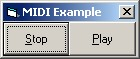



## Play a \.mid file, with ease\!

### Description

I need you! Vote for my code, I'm a poor hard-up student in England who can'y afford a pint let alone any fancy software! Thanks!

Need to play a .mid file, look no further here is your solution! This code contains an example of how to use MIDIMod.bas which I have written to play MIDI files. Very easy to use, and sample applcation included with music! Please read the readme.txt file in the xip for further information.
 
### More Info
 

             |
---                |---
**Submitted On**   |2002-02-22 22:39:54
**By**             |[Sam North](https://github.com/Planet-Source-Code/PSCIndex/blob/master/ByAuthor/sam-north.md)
**Level**          |Intermediate
**User Rating**    |4.1 (29 globes from 7 users)
**Compatibility**  |VB 5\.0, VB 6\.0
**Category**       |[Sound/MP3](https://github.com/Planet-Source-Code/PSCIndex/blob/master/ByCategory/sound-mp3__1-45.md)
**World**          |[Visual Basic](https://github.com/Planet-Source-Code/PSCIndex/blob/master/ByWorld/visual-basic.md)
**Archive File**   |[Play\_a\_\_mi569062222002\.zip](https://github.com/Planet-Source-Code/sam-north-play-a-mid-file-with-ease__1-32037/archive/master.zip)

